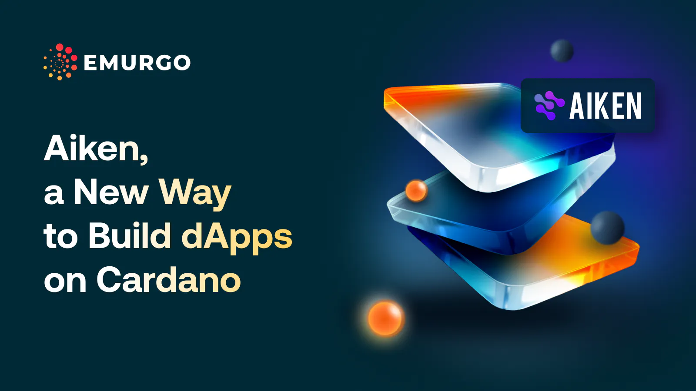

Decentralized applications (dApps) use programmable smart contracts on blockchain to provide accessible services without central authority. Unlike traditional apps with centralized backends, dApps run on open-source, decentralized networks like Cardano, offering transparency and security. Cardano, a third-generation blockchain, supports scalable, secure, and interoperable dApp development. Aiken simplifies dApp development on Cardano by offering familiar syntax, an easy compiler, and clear error handling. It’s used by popular Cardano dApps like Minswap, Sundae Swap, LenFi, and JPG Store, facilitating faster and more efficient dApp creation.

 [**Read more**](https://www.emurgo.io/press-news/aiken-a-new-way-to-build-dapps-on-cardano/) 

 

