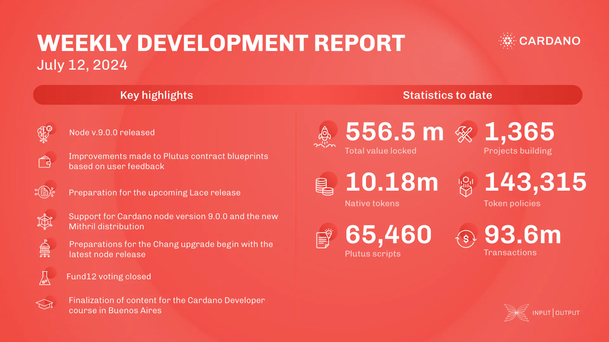

This week, the teams released node version 9.0.0, enabling the Conway ledger era with CIP-1694, Plutus V1 reference scripts, and CIP-69 support. The performance team released benchmarks for node v.8.12.0 and conducted DRep benchmarks. The consensus team supported the 9.0 release with security audits and NoThunks tests. The Plutus team improved contract blueprints and documentation. The Lace team focused on bug fixes. Mithril supported node v.9.0.0, worked on a new distribution, and fixed REST API bugs. Town Hall 170 and Fund12 voting concluded with 1.5bn ada used. The education team prepared for the Cardano Developer course and Voltaire training.

 [**Read more**](https://www.essentialcardano.io/development-update/weekly-development-report-as-of-2024-07-12) 

 

