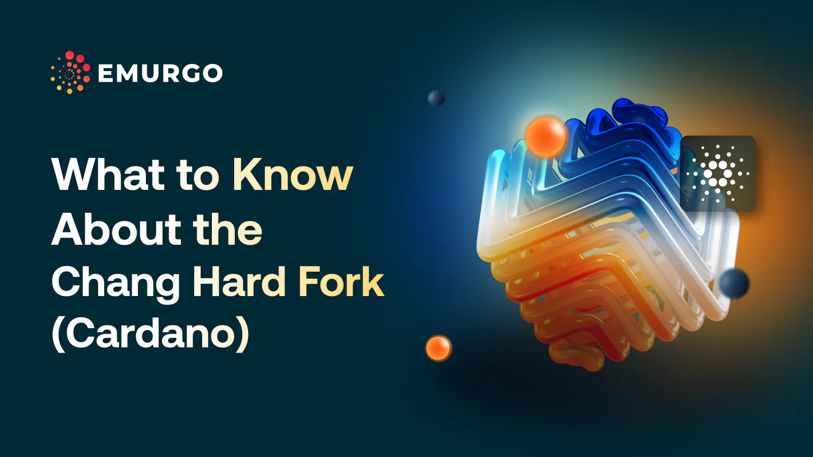

A blockchain hard fork upgrades the software run by distributed nodes, introducing new features and improving security. Cardano uses a hard fork combinator (HFC) for smooth transitions. The Chang Hard Fork requires 70% of stake pool operators and 80% of exchange liquidity to upgrade, marking the start of community-run governance outlined in CIP-1694. Part one includes the Interim Cardano Constitution and the Interim Constitutional Committee, while part two introduces Delegate Representatives, SPO voting, and treasury management, fully implementing decentralized governance by Q4 2024. This transition will make Cardano the first truly community-run blockchain network.

 [**Read more**](https://www.emurgo.io/press-news/what-to-know-about-the-chang-hard-fork-cardano/) 

 

