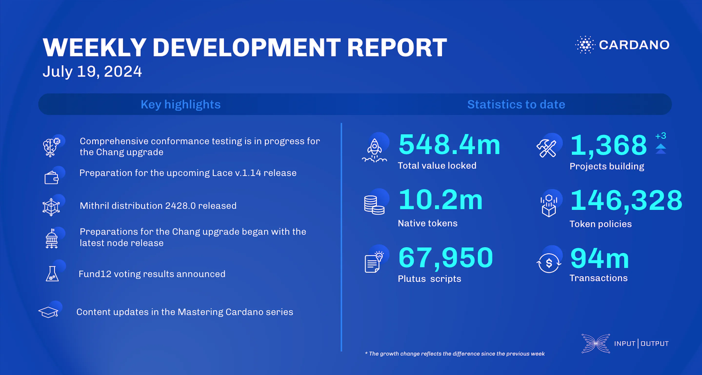

The ledger team focuses on testing for the Chang upgrade. Lace v.1.14 is upcoming. Hydra updated for node v.9.0.0 and simplified the demo setup. Mithril released distribution 2428.0, supported node v.9.0.0, fixed bugs, and optimized certification. Node users should upgrade to v.9.0.0. Fund12 results announced 258 new projects, with Town Hall 171 celebrating winners. Catalyst completed 900+ projects and allocated over 100M ADA. The education team is in Buenos Aires for the Cardano Developer course.

 [**Read more**](https://www.essentialcardano.io/development-update/weekly-development-report-as-of-2024-07-19) 

 

