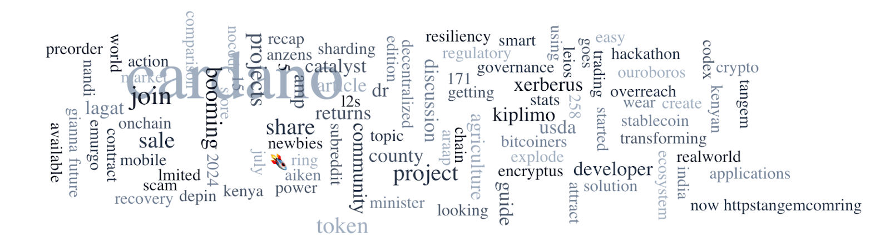

The Cardano Foundation participated in Project Catalyst Fund 12, where 258 projects received funding, highlighting the community-driven development of the Cardano ecosystem. Cardano-node 9.0.0 was released, adding on-chain governance, Plutus v1 reference scripts, and enhanced smart contract security. EMURGO announced the relaunch of the USDA stablecoin under Encryptus. Cardano Ambassador Lloyd Duhon discussed future governance innovations, including DReps and the Voltaire era. Additional updates include the release of Cardano Wallet v2024-07-19, support for Cardano Native Tokens by Tangem, and the launch of Cardano Codex 2024.

 [**Read more**](https://forum.cardano.org/t/digest-july-23-2024-project-catalyst-fund-12-voting-results-announced-cardano-node-9-0-0-released-usda-resurrected-dreps-and-the-future-of-blockchain-governance/134326) 

 

