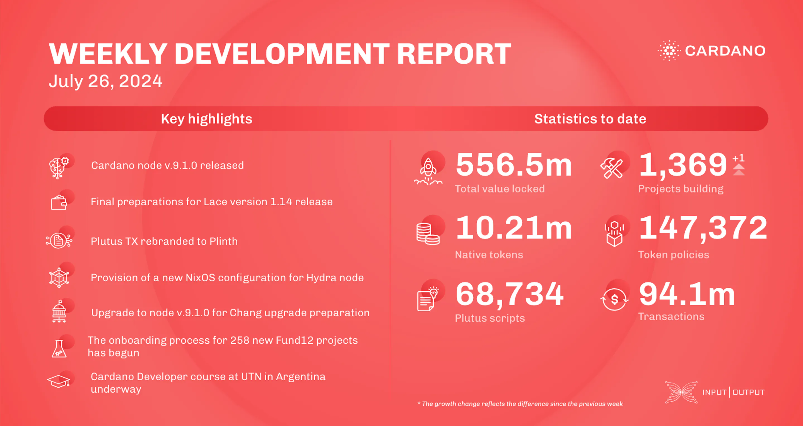

Cardano node v.9.1.0 has been released, featuring critical updates for the upcoming Chang upgrade, including a Conway genesis file, CLI enhancements, and CIP compatibility. Performance benchmarks for node v.9.0.0 showed significant improvements. The networking team advanced tx-submission design and reviewed Genesis pull requests. The Lace team is preparing for version 1.14, and Plutus TX has been rebranded as Plinth. The Hydra and Mithril teams made progress on network reliability and transaction certification. The education team is in Argentina teaching a Cardano Developer course.

 [**Read more**](https://www.essentialcardano.io/development-update/weekly-development-report-as-of-2024-07-26) 

 

