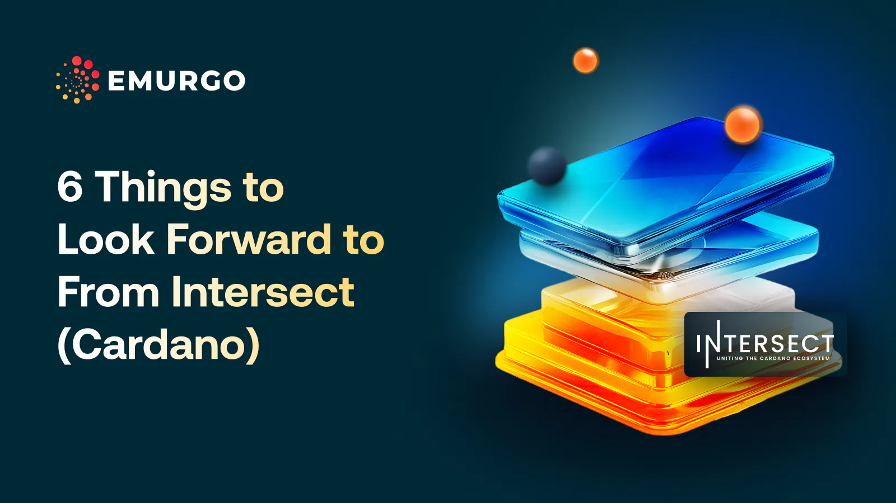

In 2024, Cardano is transitioning to a fully community-run governance structure, with Intersect playing a crucial supporting role. Six key developments to expect include:

	1.	Cardano Constitution workshops: Intersect will organize workshops to gather community feedback for drafting the Cardano Constitution.
	2.	Cardano Constitutional Convention: Set for December 2024, this event in Buenos Aires will present and potentially ratify the final Constitution.
	3.	DRep launch: The first batch of Delegate Representatives (DReps) will begin operating, enabling direct community participation in governance.
	4.	Intersect grants: Intersect will provide grants for technical projects and event organization.
	5.	Community hubs: Intersect will support local gatherings and hackathons to unite the Cardano ecosystem.
	6.	Governance educational videos: Intersect will release video series to educate the community on Cardano governance.

 [**Read more**](https://www.emurgo.io/press-news/6-things-to-look-forward-to-from-intersect-cardano/) 

 

