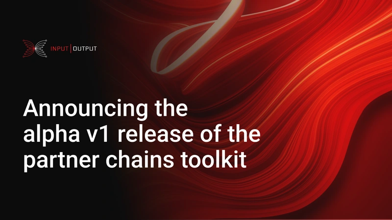

Input Output Global has launched the alpha v1 release of partner chains, enabling new blockchain networks to bootstrap security by leveraging Cardano's stake pool operators (SPOs). This release introduces innovations like shared security, mixed validator committees, and consensus model flexibility, allowing partner chains to benefit from Cardano's extensive network. While this release is not for live production, it marks a significant milestone in realizing Charles' vision. Midnight will be the first partner chain to use this technology, with further developments and feedback expected in the coming months.

 [**Read more**](https://iohk.io/en/blog/posts/2024/08/01/announcing-the-alpha-v1-release-of-the-partner-chains-toolkit/) 

 

