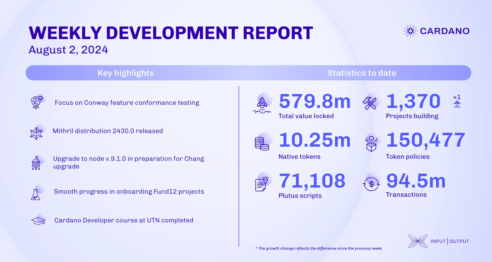

The ledger team focused on Conway features and fixed a bug affecting functionality post-bootstrap. Hydra worked on network reliability, upgraded the Hydra head for node compatibility, and introduced a technical writing guide. Mithril released distribution 2430.0, supporting Cardano node 9.1.0, activated transaction certification in test networks, and continued CIP drafting. Catalyst's onboarding is progressing, with Town Hall 173 marking Fund12's end. The education team completed a Cardano Developer course in Buenos Aires and organized a graduation event for smart contract developers.

 [**Read more**](https://www.essentialcardano.io/development-update/weekly-development-report-as-of-2024-08-02) 

 

