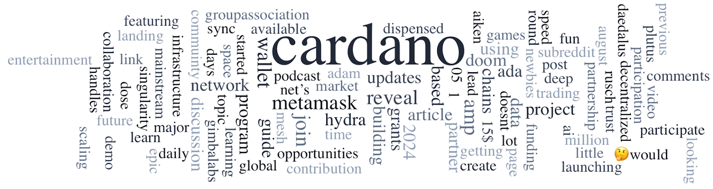

Cardano is strengthening its presence in Argentina through key initiatives, including developer workshops, the ADN event, and discussions with government officials. The ALBA program at UTN is advancing blockchain education, and a recent workshop led by IOG culminated in a graduation event attended by Charles Hoskinson. The ADN event showcased blockchain innovations, while government talks explored blockchain's potential in Argentina. Additionally, Cardano's first community-driven Constitutional Workshop was held in Argentina. These activities highlight Cardano's commitment to local engagement and blockchain innovation. The Cardano Foundation also launched the SSI Wallet Alpha Program, inviting users to test and contribute to its development.

 [**Read more**](https://forum.cardano.org/t/digest-august-6-2024-cardano-strengthens-presence-in-argentina-cardano-foundation-introduces-self-sovereign-identity-ssi-wallet-alpha-program-join-your-local-cardano-constitutional-workshops/134804) 

 

