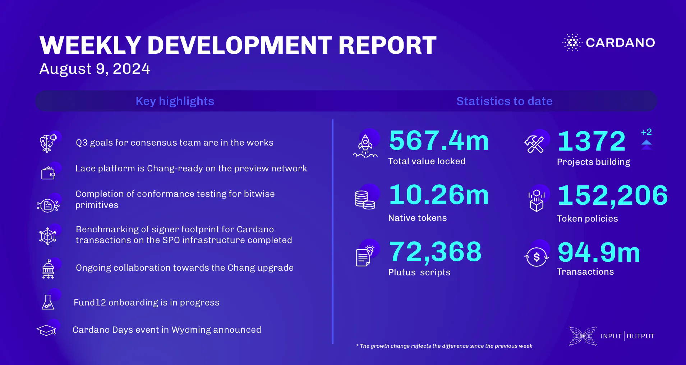

The consensus team began work on Q3 2024 goals, focusing on `db-truncater` behavior, EmptySlot error details, new trace messages, and UTXO-HD feature branch updates. Lace is prepared for the Chang upgrade and DRep registration on the mainnet. Plutus completed testing bitwise primitives, now improving Plinth documentation. Hydra made progress on bug fixes and Agda transition, while Mithril worked on stake distribution certification and nearly completed a CIP draft. Catalyst Fund12 onboarding is progressing, and the education team wrapped up a successful course in Argentina, preparing for the upcoming Cardano Days event in Wyoming.

 [**Read more**](https://www.essentialcardano.io/development-update/weekly-development-report-as-of-2024-08-09) 

 

