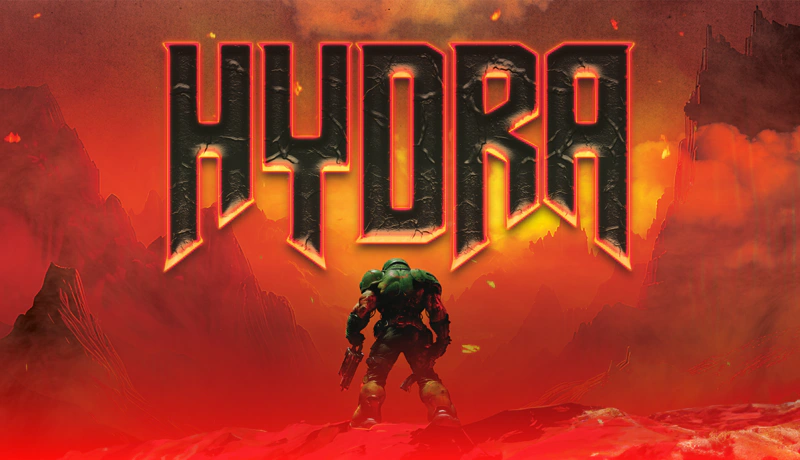

Doom (1993) remains a cultural icon, now demonstrated on Cardano's blockchain using Hydra heads. By leveraging Hydra's ability to handle complex operations off-chain, the game runs in real-time through smart contracts validating deterministic game states. While running Doom on a blockchain is impractical, this tech demo highlights Hydra's potential, offering open-source components and innovative approaches that could inspire new blockchain applications.

 [**Read more**](https://iohk.io/en/blog/posts/2024/08/16/running-doom-on-blockchain-a-landmark-moment-for-cardano-and-hydra/) 

 

