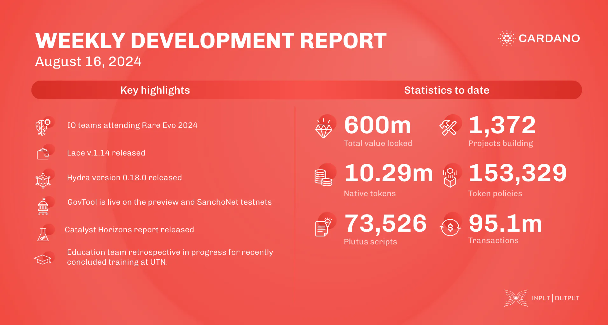

The ledger team added minor features like ledger state queries for voting on proposals and transaction size computations, while focusing on Conway testing and conformance tests. The Lace team released version 1.14 with CIP-95 support and bug fixes. Hydra released version 0.18.0, addressing a Conway fork issue and adding incremental decommits. GovTool is active on preview and SanchoNet, with 67% of stake upgraded to node v.9.1.0 for the Chang upgrade. Catalyst released the Catalyst Horizons report and is preparing for engagements at Rare Evo. The education team is reviewing the Cardano Developer course and updating "Mastering Cardano".

 [**Read more**](https://www.essentialcardano.io/development-update/weekly-development-report-as-of-2024-08-16) 

 

