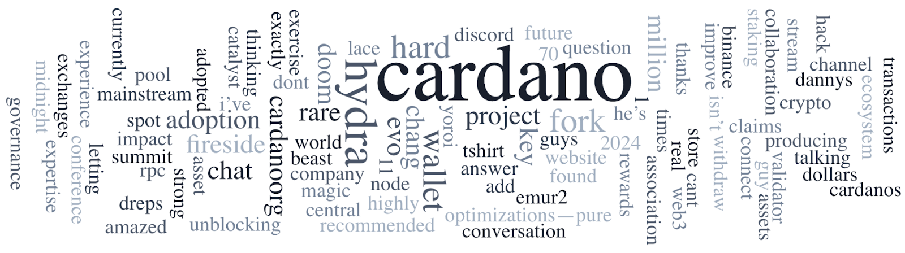

Las Vegas hosted the RareEvo blockchain conference from August 15-17, attracting projects and community members from Cardano and other blockchain ecosystems. Highlights included keynotes from Charles Hoskinson, a live Hydra Doom demonstration, and an interview with presidential candidate Robert F. Kennedy Jr. The Hydra team showcased Cardano’s layer 2 solution by running one local game of Doom with 35 transactions per second, processing over 86 million transactions by August 19. RareEvo proved to be a significant event, demonstrating Cardano's scalability and innovation potential. More insights and impressions can be found by searching #rareevo24 on X.

 [**Read more**](https://forum.cardano.org/t/digest-august-19-2024-las-vegas-captivated-by-rareevo-hydra-doom-steals-the-show-at-rareevo-a-spotlight-on-stake-pools-with-ada-pool/135140) 

 

