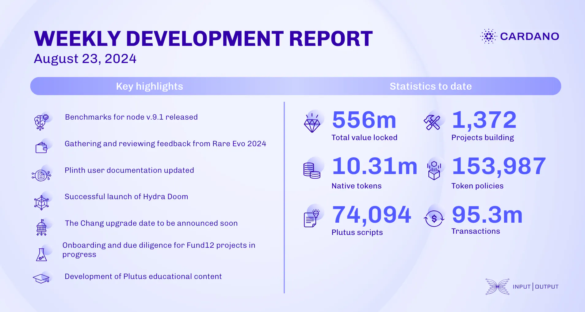

The performance and tracing team released node v.9.1 benchmarks, improved resource trace emission, and integrated non-systemd Linux support in cardano-tracer. The consensus team enhanced `ChainSync` client testing and reviewed the final Genesis statement of work. The Lace team is reviewing feedback from Rare Evo 2024 for future updates. Plutus team updated Plinth documentation, while Hydra launched the Hydra Doom project. Mithril completed stake distribution certification and drafted a CIP for signature diffusion. The Chang hard fork is set for late August, marking Cardano's entry into the Conway ledger era. Fund13 preparation continues, and the education team is gathering feedback and updating content.

 [**Read more**](https://www.essentialcardano.io/development-update/weekly-development-report-as-of-2024-08-23) 

 

