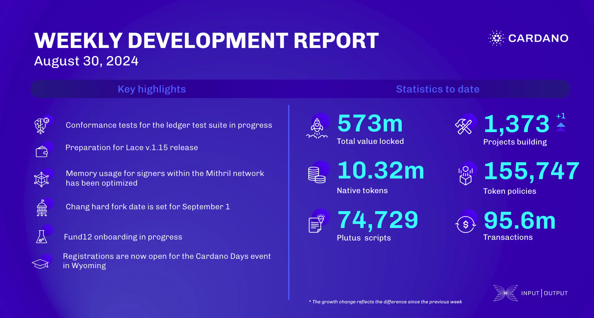

The `ledger` team focused on conformance tests, improving the ledger test suite, and preparing for the upcoming hard fork by documenting changes affecting DApp developers. The `SRE` team upgraded the pre-production network to the Conway era and made various infrastructure improvements. The `Lace` team is set to release version 1.15 with enhanced governance capabilities. The `Mithril` team is decentralizing signature orchestration and optimizing memory use. The `Voltaire` team prepared for the Chang #1 hard fork on September 1. `Catalyst` advanced Fund12 onboarding and achieved progress in the Hermes project, while the `education` team preps for Cardano Days.

 [**Read more**](https://www.essentialcardano.io/development-update/weekly-development-report-as-of-2024-08-30) 

 

