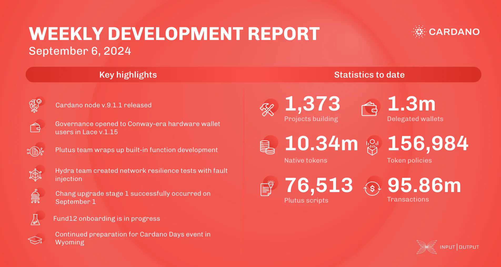

Cardano's core teams released node v.9.1.1 to fix replay issues in the Conway era and introduced a snapshot-converter for UTXO-HD. Governance for hardware wallets improved, Plutus advanced built-in functions, and Hydra enhanced network resilience. Mithril progressed decentralization, Voltaire emphasized community governance, and Catalyst focused on Fund12 onboarding. Education supported Plutus updates and prepared for Cardano Days events.

 [**Read more**](https://www.essentialcardano.io/development-update/weekly-development-report-as-of-2024-09-06) 

 

