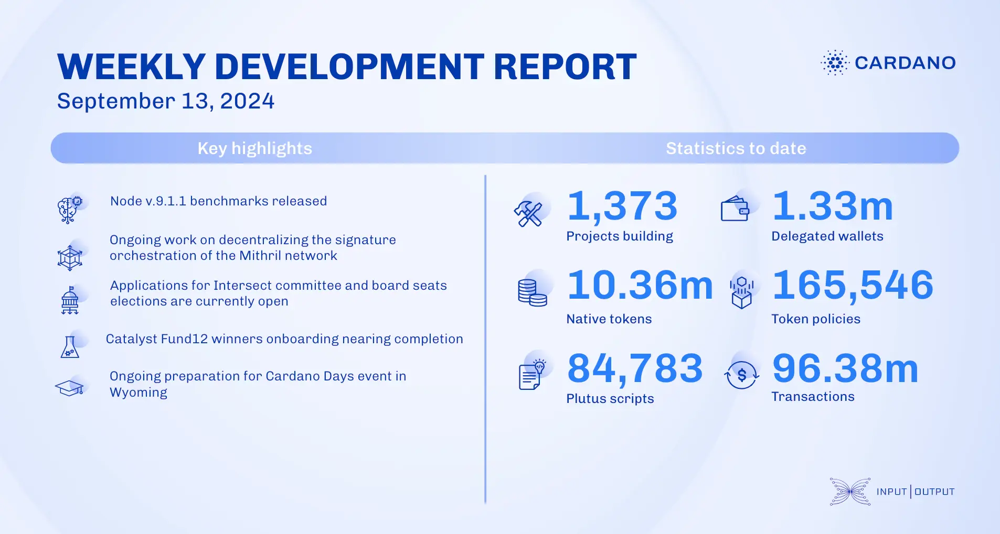

The ledger team implemented a Conway-related feature preventing certain stake credentials from withdrawing rewards if not delegated to a DRep, effective post-bootstrap phase. They also addressed minor bugs and improved test reliability. The performance and tracing team released benchmarks for node v.9.1.1, established a new performance baseline, and optimized infrastructure. The Mithril team progressed in decentralizing signature orchestration, refactoring the signer state machine, and enhancing transaction handling. Voltaire development continues, with applications open for committee and board seats until September 27. Catalyst's town hall 174 previewed Fund13's categories, and onboarding for Fund12 winners nears completion. The education team is preparing content for upcoming Cardano Days events and updating the 'Mastering Cardano' book.

 [**Read more**](https://www.essentialcardano.io/development-update/weekly-development-report-as-of-2024-09-13) 

 

