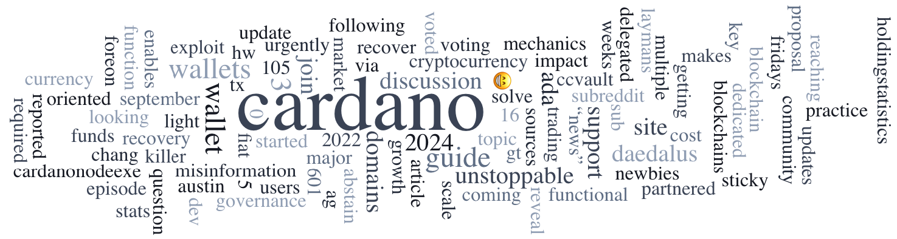

The Project Catalyst Team has announced Fund 13, starting on September 25, 2024, with 50 million ada available for distribution. Proposal submissions open on September 26. The updated 2024 Cardano Summit agenda features keynotes, panels, and masterclasses, offering valuable insights into blockchain's future. Additional updates include the announcement of Summit Community Partners, a recap of the first SPO Table Talk on CIP-1694's impact on SPO operations.

 [**Read more**](https://forum.cardano.org/t/digest-september-16-2024-project-catalyst-fund-13-launch-date-announced-and-cardano-summit-updates/136054) 

 

