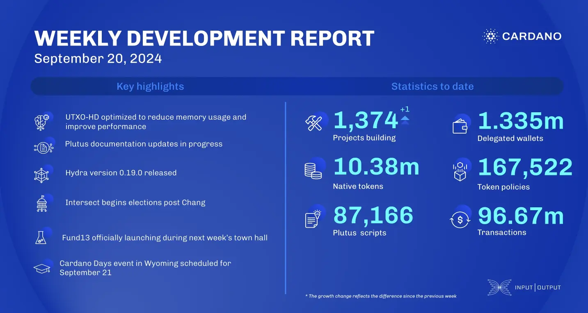

The consensus team addressed performance issues related to ledger snapshots, proposed bandwidth optimization, and improved UTXO-HD benchmarking. The Plutus team updated user documentation, including troubleshooting and contract blueprints. Hydra released version 0.19.0, adding Conway ledger support. Mithril progressed on decentralizing signature orchestration. Intersect advanced the Chang upgrade with elections ongoing. Catalyst previewed Fund13 during town hall 175, with its launch planned for next week.

 [**Read more**](https://www.essentialcardano.io/development-update/weekly-development-report-as-of-2024-09-20) 

 

