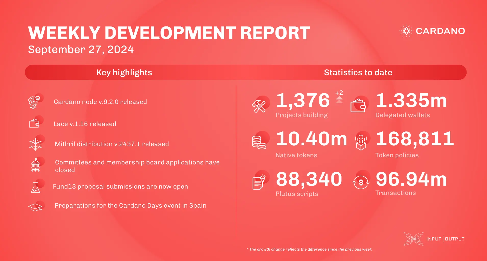

The core technology teams released Cardano node v.9.1.1 to fix an issue causing nodes to replay from the genesis block during restarts in the Conway era. The consensus team introduced a snapshot-converter tool to convert non-UTXO-HD snapshots to UTXO-HD, resolving deserialization issues and a memory leak. The Lace team improved governance for hardware wallet users and prepared for v.1.16. The Plutus team completed built-in functions for the next hard fork. The Hydra team focused on network resilience and incremental commits. The Mithril team continued decentralizing signature orchestration and improving network operations. Voltaire marked Cardano's transition to community governance. Catalyst progressed in Fund12 onboarding and wallet integration. The education team prepared for Cardano Days events and supported updates in Plutus Core.

 [**Read more**](https://www.essentialcardano.io/development-update/weekly-development-report-as-of-2024-09-27) 

 

