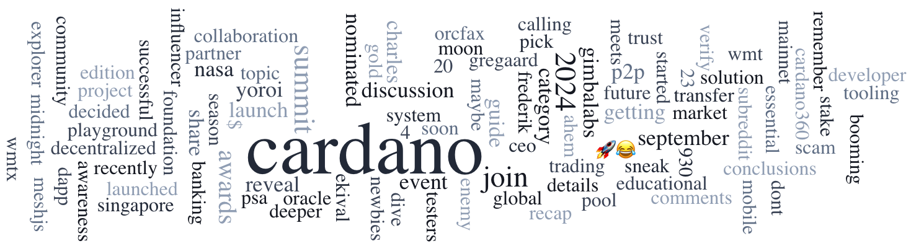

The Cardano Summit Awards voting is now open, recognizing excellence across 11 categories within the ecosystem. The Developer Blog Series features an interview with Sricharan Ganta, CEO of Nucast, discussing innovations in digital media ownership on Cardano. The Stake Pool Spotlight highlights GROW, a pool dedicated to charitable initiatives in Africa. Ambassador Stories introduces Jose Iadicicco, a Meetup Organizer advancing blockchain education in Argentina.

 [**Read more**](https://forum.cardano.org/t/digest-september-30-2024-cast-your-vote-for-the-2024-cardano-summit-awards-developer-blog-series-with-nucast-a-spotlight-on-stake-pools-with-grow-ambassador-stories-with-jose-iadicicco/136483) 

 

