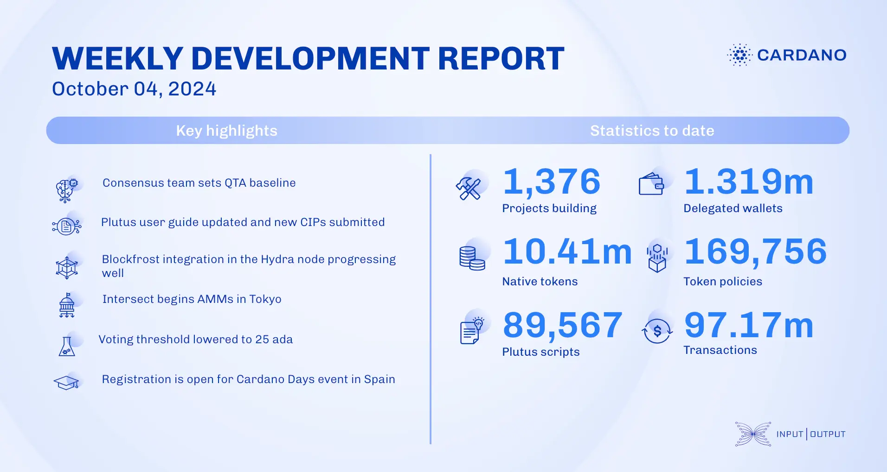

The consensus team set performance goals, rebased UTXO-HD, and improved robustness. Plutus revamped user guides and submitted CIPs on arrays and maps. Hydra advanced incremental commits, Blockfrost integration, and tested Raft networking. Mithril decentralized signature orchestration and prepared for node v.9.2.1. Intersect held annual meetings, and Catalyst opened Fund13 proposals. Education prepped for Cardano Days in Santander and attended the Constitution event in Oslo.

 [**Read more**](https://www.essentialcardano.io/development-update/weekly-development-report-as-of-2024-10-04) 

 

