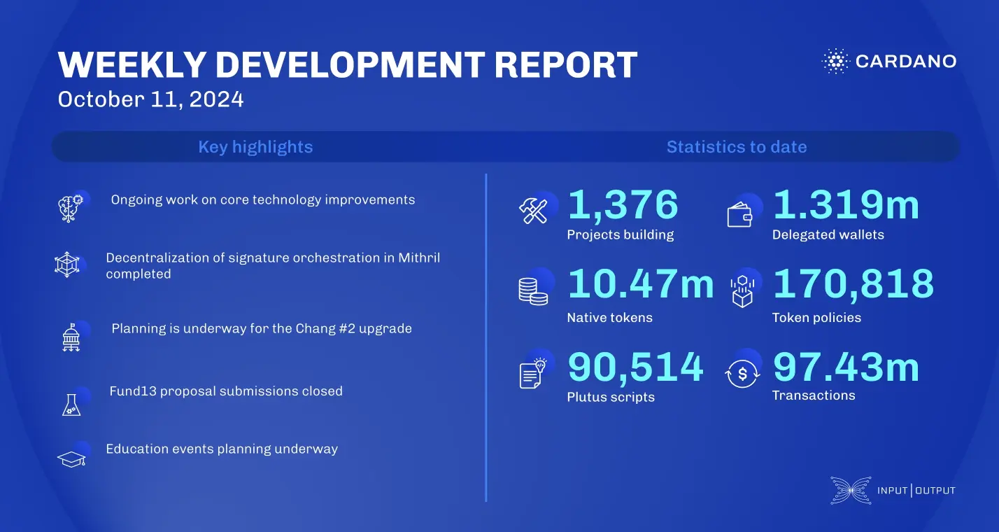

The DB Sync team resolved off-chain data issues and improved memory management. Node v.9.2 benchmarks advanced, and cardano-tracer-0.3 was released. Mithril progressed decentralization, and Intersect elections close October 20. Chang #2 hard fork planning aligns with CIP-1694. Catalyst Fund13 submissions finalize with reviews ongoing. Community contributions to Cardano core rose to 45.97%. The education team preps for the Cardano Summit in Argentina and December constitution events.

 [**Read more**](https://www.essentialcardano.io/development-update/weekly-development-report-as-of-2024-10-11) 

 

