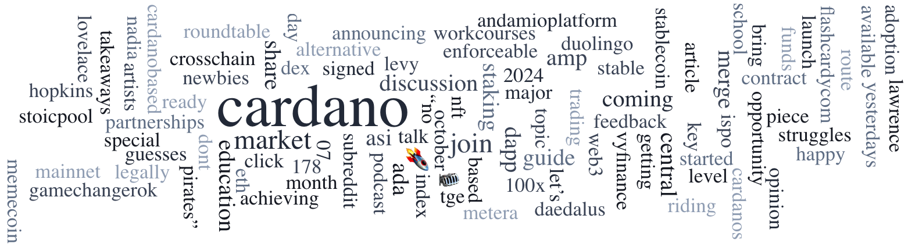

The 3rd Governance Info Action is live, inviting DReps, SPOs, and ICC members to vote on increasing the K parameter to enhance decentralization. Developers are encouraged to participate in the annual State of the Cardano Developer Ecosystem Survey to provide insights for future improvements. Rhys Morgan has launched a new Aiken programming course, offering tutorials on smart contract development. The Cardano Foundation introduces 'Our Cardano,' outlining its ecosystem ethos and principles to foster a thriving, decentralized community.

 [**Read more**](https://forum.cardano.org/t/digest-october-14-2024-3rd-governance-info-action-live-dreps-spos-and-icc-members-urged-to-vote-participate-in-the-cardano-developer-ecosystem-survey-new-aiken-programming-course-by-rhys-morgan-cardano-foundation-launches-our-cardano/137192) 

 

