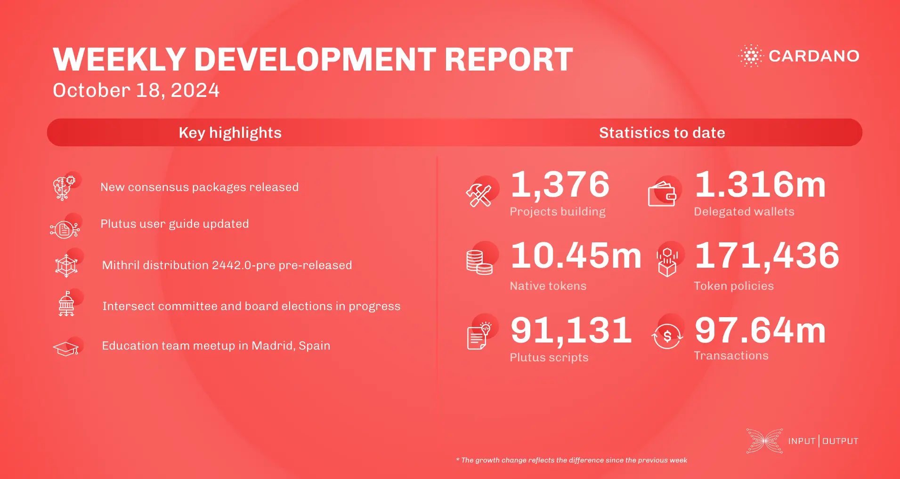

The consensus team released updated packages, improved IOSim, and reduced header clock skew. The ledger team added protections against deposit loss, updated delegation rules, and refined SPO vote thresholds. Plutus enhanced user guides, Hydra progressed incremental commits with Aiken integration, and Mithril prepared for the Pythagoras era. Intersect elections and Chang #2 upgrade planning continue. The education team held a Madrid meetup and preps for the Cardano Summit in Argentina.

 [**Read more**](https://www.essentialcardano.io/development-update/weekly-development-report-as-of-2024-10-18) 

 

