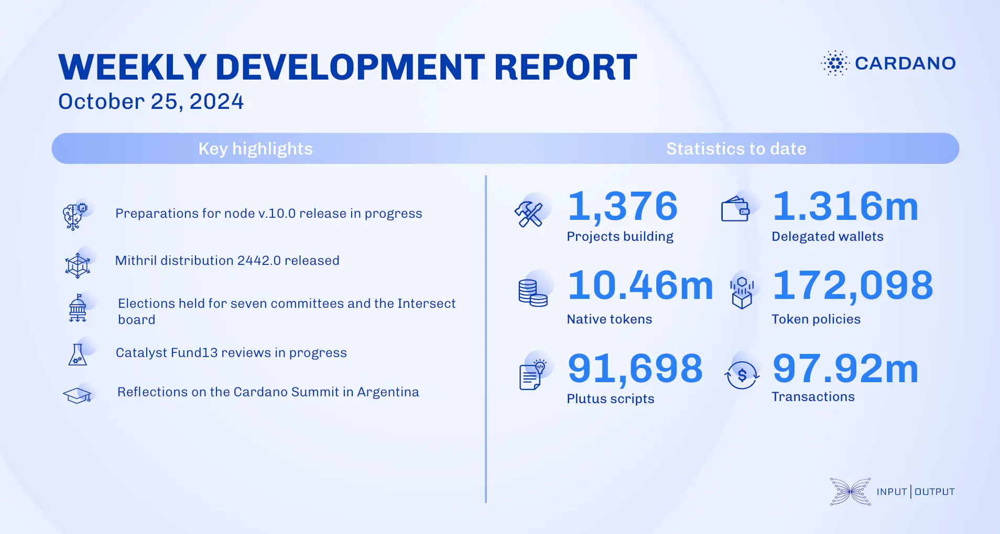

The ledger team finalized protocol version 10.0 changes, enabling simultaneous reward account unregistration and fund withdrawal, and ensuring DRep verification for all stake credential delegations. They continued testing Conway features and advanced conformance tests. The performance and tracing team began benchmarking node version 10.0, calibrated governance action voting workloads, and updated tracing components to align with cardano-tracer version 0.3. The Mithril team released distribution 2442.0, supporting decentralized signature orchestration and the Pythagoras Mithril era, and implemented usage metrics with Prometheus and Grafana. Intersect conducted elections for seven committees and its board, onboarding new members from October 28 to November 8. Catalyst moved Fund13 into the community review stage, with town hall 180 nearing 1,000 completed projects. The education team supported the Cardano Summit in Argentina and continued work on the 'Mastering Cardano' book.

 [**Read more**](https://www.essentialcardano.io/development-update/weekly-development-report-as-of-2024-10-25) 

 

