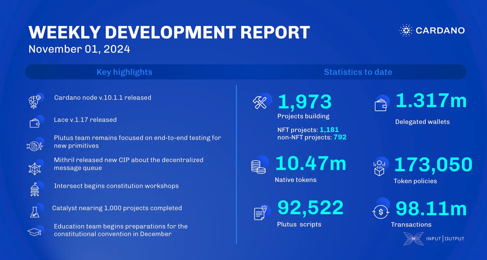

The core technology teams released node v.10.1.1 for the Chang #2 upgrade, enhancing governance with SPO delegation and auto-abstain DRep votes. Lace v.1.17 introduced shared wallets in beta. Plutus conducted end-to-end testing for new primitives, and Hydra advanced incremental commits and on-chain validators. Mithril released CIP-137 for decentralized message queues and added Prometheus-based metrics.

 [**Read more**](https://www.essentialcardano.io/development-update/weekly-development-report-as-of-2024-11-01) 

 

