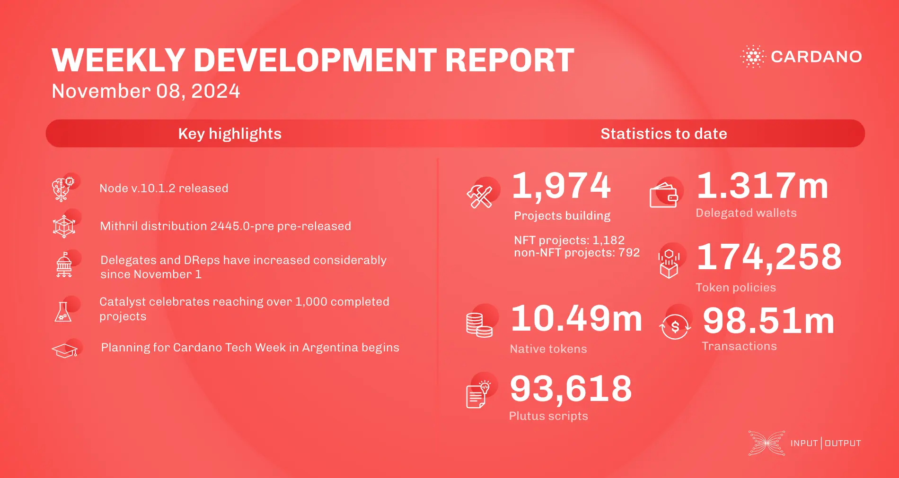

The core technology teams released node v.10.1.2, updating the previous version. The DB Sync team prepared version 13.6.0.0, compatible with node v.10.1.0, currently in testing before mainnet release. The ledger team improved internal code quality and introduced a query to determine default votes for specific stake pool operators. The performance and tracing team conducted governance action benchmarks, implemented decentralized submission via `cardano-cli`, and released `cardano-tracer-0.3`. The Mithril team created distribution pre-release 2445.0-pre, recorded aggregator metrics, and explored solutions for signer registration with multiple aggregators. Voltaire's node v.10.1.2 incorporated community feedback, mirroring v.10.1.1's functionality. Catalyst's community review stage is progressing, celebrating over 1,000 completed projects during town hall 182. Voter registration continues until November 20, with technical development of Catalyst Voices focusing on minimum viable experience 2. 

 [**Read more**](https://www.essentialcardano.io/development-update/weekly-development-report-as-of-2024-11-08) 

 

