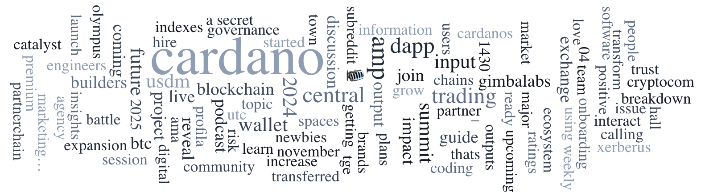

The Cardano Summit 2024 in Dubai featured masterclasses on topics such as decentralized governance, sidechains, and protocol parameters; recordings are now available on the Cardano Community YouTube channel. The interim Constitutional Committee has voted on the 3rd Governance Info Action regarding the potential increase of the K parameter. Intersect invites community participation in the 2025 annual budget survey to guide resource allocation and ecosystem growth.

 [**Read more**](https://forum.cardano.org/t/digest-november-11-2024-cardano-summit-dubai-2024-masterclass-recordings-now-available-constitutional-committees-votes-on-3rd-governance-info-action-2025-annual-budget-survey-now-live-have-your-say/138494) 

 

