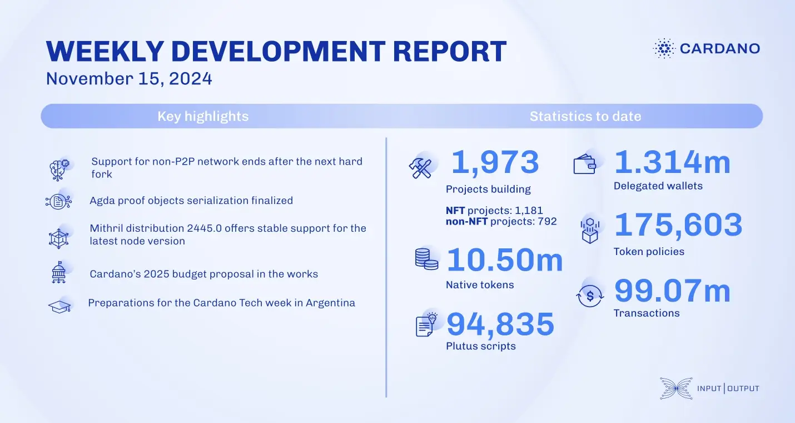

The core technology teams assessed Ouroboros Leios feasibility and integrated `ouroboros-network` for Mithril. Non-P2P support will end post-next hard fork. The consensus team reviewed UTXO-HD and hard fork combinator updates, while Plutus advanced compilation tools and ScriptContext API. Mithril released distribution 2445.0, supporting node v.10.1. Hydra progressed on incremental commits and validator rewrites. Intersect's budget committee prepares Cardano treasury allocations for 2025.

 [**Read more**](https://www.essentialcardano.io/development-update/weekly-development-report-as-of-2024-11-15) 

 

