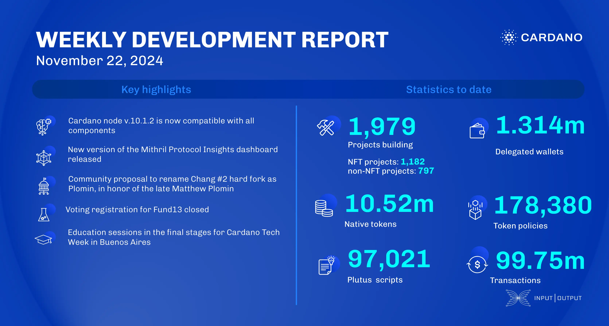

The core technology teams released components compatible with the latest Cardano node, including DB Sync and Cardano wallet updates. The ledger team shared the ImpSpec framework, while performance teams enhanced benchmarking and locli analysis. Mithril prepared for the Pythagoras era, and Hydra's Doom tournament qualifiers start December 3. The Constitutional Convention will vote on the Cardano constitution, and the community may rename Chang #2 to the Plomin hard fork.

 [**Read more**](https://www.essentialcardano.io/development-update/weekly-development-report-as-of-2024-11-22) 

 

