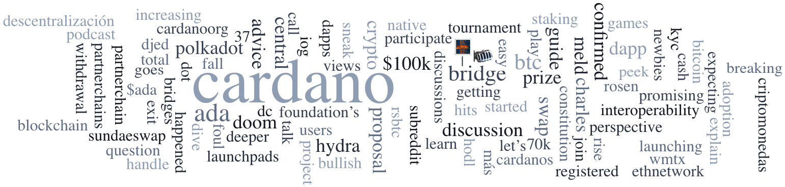

The first Cardano Constitutional Convention is scheduled for December 4–6, 2024, in Buenos Aires, Argentina, and Nairobi, Kenya, aiming to draft and ratify the Cardano Constitution based on extensive community feedback. A recent roundtable discussion featured key ecosystem members deliberating on the draft constitution, fostering transparency and community engagement. The Stake Pool Spotlight highlights WADA, a pool dedicated to supporting innovation and ecosystem growth across the African continent.

 [**Read more**](https://forum.cardano.org/t/digest-november-26-2024-what-to-expect-at-the-cardano-constitutional-convention-in-december-2024-roundtable-talk-cardano-constitution-drafts-a-spotlight-on-stake-pools-wada/139522) 

 

