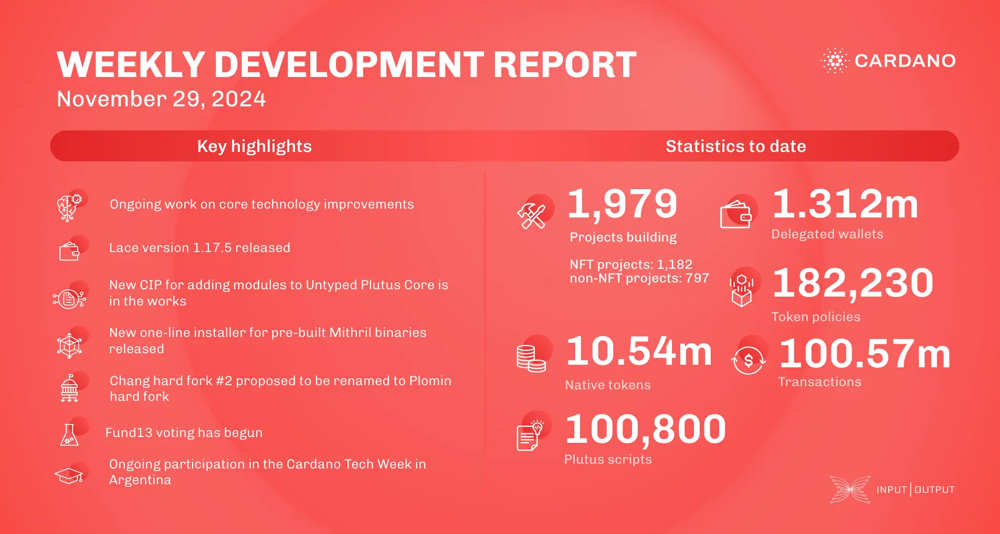

The consensus team refined Praos documentation and addressed chain growth violations. DB Sync v.13.6.0.2 improved rollbacks, Lace v.1.17.5 enhanced syncing, and Hydra advanced API filtering. Mithril introduced a one-line installer and new certifications. Catalyst Fund13 voting began on November 28, and the Constitutional Convention on December 4–6 will address the Cardano constitution. A proposal suggests renaming Chang #2 to the Plomin hard fork.

 [**Read more**](https://www.essentialcardano.io/development-update/weekly-development-report-as-of-2024-11-29) 

 

