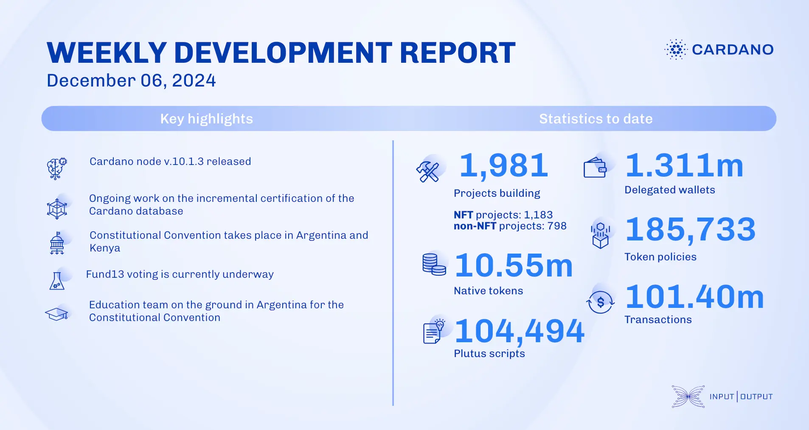

The SRE team released Cardano node v.10.1.3 and DB Sync updates, improving mainnet bootstraps and dashboards. The ledger team fixed a bug in protocol version 10 and added a query for DRep voting stake distribution. Mithril advanced incremental certification and enhanced certificate verification. The Constitutional Convention in Buenos Aires and Nairobi ratified a new Cardano constitution. Catalyst Fund13 voting continues until December 12, with over 1.5 billion ada in voting power. The education team held Cardano Days sessions and demonstrated live node use with a mobile SPO learning lab.

 [**Read more**](https://www.essentialcardano.io/development-update/weekly-development-report-as-of-2024-12-06) 

 

