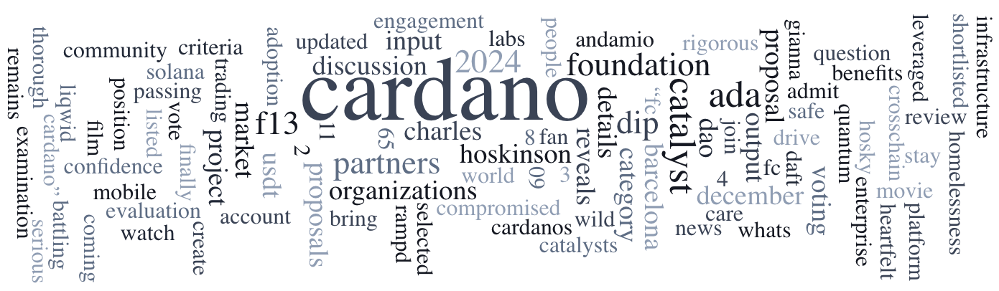

The December 11, 2024, Digest highlights a Roundtable Talk on Nested Transactions (CIP-0118) and a Developer Blog featuring DexHunter CEO Nikita Melentjevs discussing on-chain analytics. Fund13 voting concludes on December 12, 11 a.m. UTC, with tools like cgov.app and tempo.vote supporting governance participation. Additional insights cover liquid staking in Cardano and tips to recognize common scams.

 [**Read more**](https://forum.cardano.org/t/digest-december-11-2024-roundtable-talk-understanding-nested-transactions-developer-blog-series-dexhunter-final-call-for-fund-13-voting/140675) 

 

