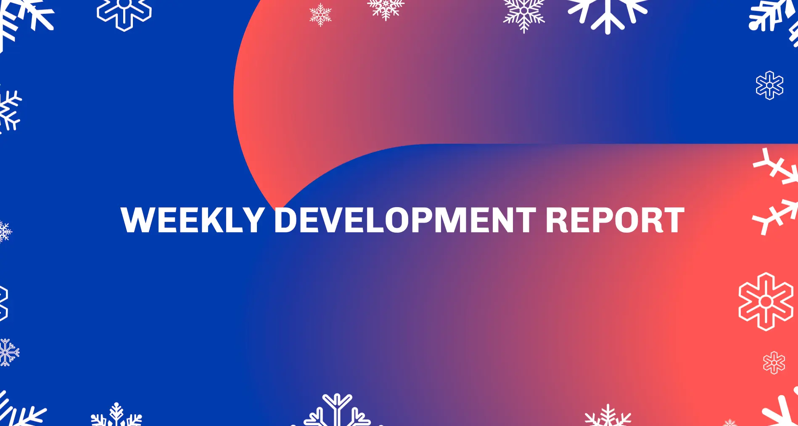

The December 13, 2024, development report concludes the year, with updates resuming January 10, 2025. The networking team, in collaboration with the Cardano Foundation, noted 98.4% of transactions are included within two blocks, showing minimal congestion. The consensus team advanced UTXO-HD and reviewed low participation handling. Daedalus v.7.0.2 launched, enabling users to delegate voting power to DReps or select automatic voting options, enhancing governance participation.

 [**Read more**](https://www.essentialcardano.io/development-update/weekly-development-report-as-of-2024-12-13) 

 

