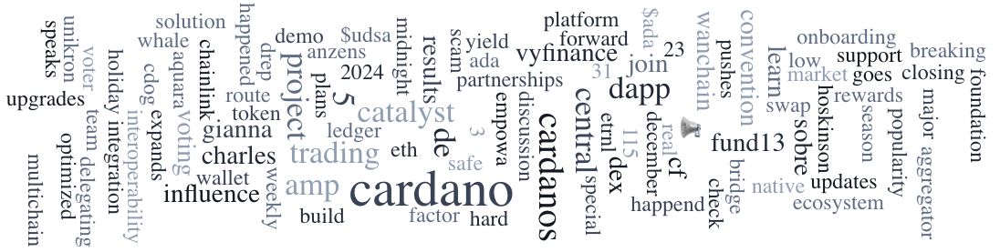

The December 23, 2024, Digest highlights Catalyst Fund 13 results, with 2.5 billion ada funding 199 projects through 311,000 votes. Governance decentralization and community input were key discussion points. The Messari Q3 2024 report noted a 31.2% revenue decrease, a 13.3% increase in DeFi TVL to $231.6M, and a 145.5% rise in USDM’s market cap to $7.9M.

 [**Read more**](https://forum.cardano.org/t/digest-december-23-2024-catalyst-fund-13-results-community-feedback-messari-q3-2024-report-key-insights-season-s-greetings/141174) 

 

