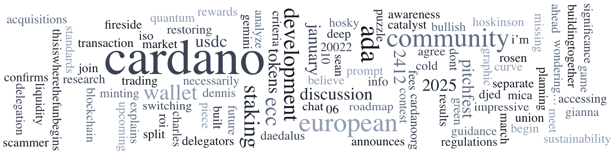

The January 6, 2025, *Cardano Community Digest* calls on SPOs to vote on the Plomin Hard Fork, which introduces Protocol Version 10 for governance and technical upgrades. With 83.13% of staked ada yet to vote, 51% participation is needed. The Digest also spotlights LOGIC, a stake pool supporting projects like NEWM and Aiken, showcasing community and technical contributions.

 [**Read more**](https://forum.cardano.org/t/digest-january-6-2025-new-year-s-message-call-to-action-spos-to-vote-on-hard-fork-initiation-plomin-hard-fork-a-spotlight-on-stake-pools-logic-pool/141690) 

 

