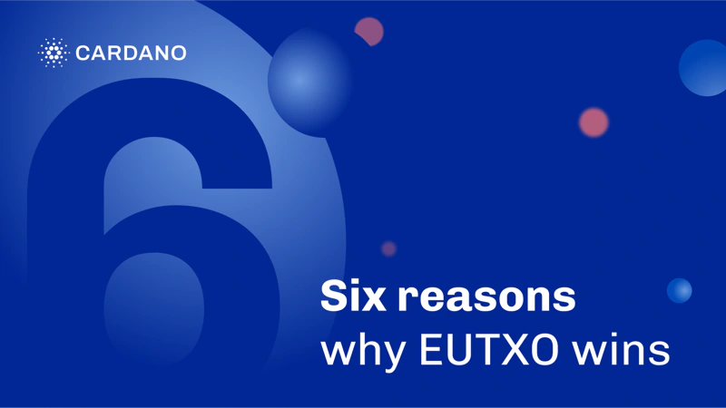

Cardano's EUTXO model provides six key benefits over account-based systems: predictable transactions, ensuring no fees for failed transactions; predictable costs, allowing accurate calculation of fees and resources; enhanced concurrency for simultaneous transaction processing; improved security through determinism and reduced attack vectors; flexibility for innovative decentralized applications; and compatibility with zero-knowledge proofs, enabling complex off-chain computations with verifiable on-chain results. These advantages make EUTXO a scalable, secure, and versatile framework for blockchain applications. For more, read the full article.

 [**Read more**](https://iohk.io/en/blog/posts/2025/01/08/six-reasons-why-eutxo-wins/) 

 

