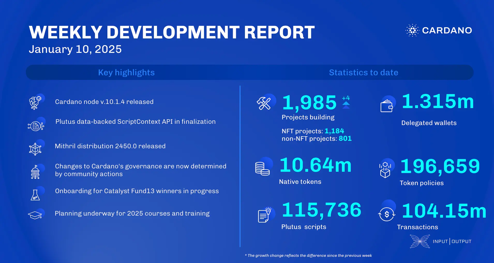

The January 10, 2025, development report highlights the release of Cardano node v.10.1.4, preparing for the Plomin hard fork with enhanced mempool safeguards. The consensus team improved time management and block-fetch synchronization. Plutus Core is finalizing the data-backed `ScriptContext` API for better script performance. Hydra advanced incremental commits and multi-version support for its explorer, while Mithril released distribution 2450.0, supporting Cardano node v.10.1.3.

 [**Read more**](https://www.essentialcardano.io/development-update/weekly-development-report-as-of-2025-01-10) 

 

