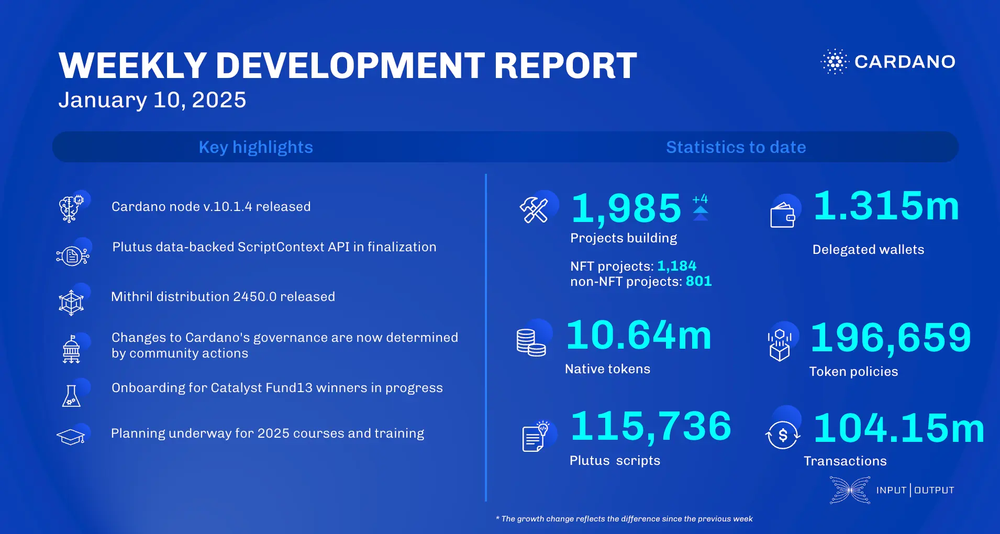

Cardano node v.10.1.4 has been released, featuring mempool safeguards in preparation for the Plomin hard fork. The consensus team improved time management and block-fetch synchronization, while Plutus Core is finalizing the data-backed ScriptContext API to enhance script performance. Hydra has advanced incremental commits and explorer support, and Mithril released distribution 2450.0 to support node v.10.1.3.

 [**Read more**](https://www.essentialcardano.io/development-update/weekly-development-report-as-of-2025-01-10) 

 

