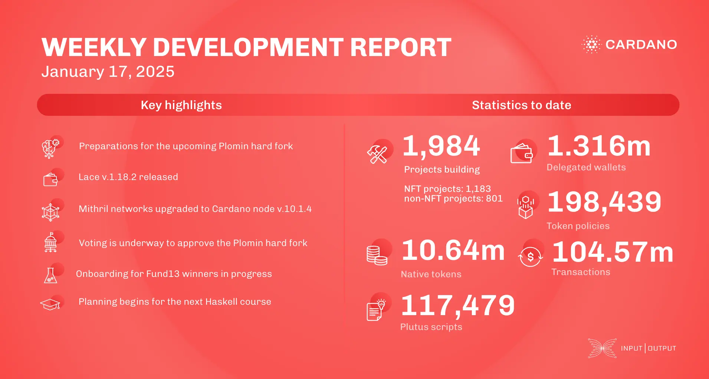

The January 17, 2025, development report focuses on final preparations for the Plomin hard fork, including bug fixes and code simplifications. Stake pool operators are urged to upgrade to node v.10.1.4. Lace v.1.18.2 improved crash recovery and fixed CIP-95 bugs. Mithril certified stake distribution on the mainnet and upgraded to node v.10.1.4. The Ouroboros Leios project progressed simulations to enhance network throughput. Voting for the Plomin hard fork continues.

 [**Read more**](https://www.essentialcardano.io/development-update/weekly-development-report-as-of-2025-01-17) 

 

