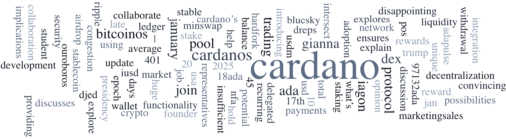

The January 20, 2025, *Cardano Community Digest* urges all node users, especially Stake Pool Operators (SPOs), to upgrade to node version 10.1.4 to prepare for the Plomin hard fork. As of now, 85% of blocks are produced using this version. The Interim Constitutional Committee (iCC) is assessing the governance action's constitutionality, requiring a two-thirds majority by January 25, 2025. The Digest also introduces Cardano Delegated Representatives (DReps) on the Cardano Forum and discusses the network's minimum pool cost.  

 [**Read more**](https://forum.cardano.org/t/digest-january-20-2025-all-cardano-node-users-encouraged-to-upgrade-to-node-version-10-1-4-current-status-of-the-icc-voting-introducing-cardano-dreps-on-the-cardano-forum-understanding-cardano-s-min-pool-cost/142215) 

 

