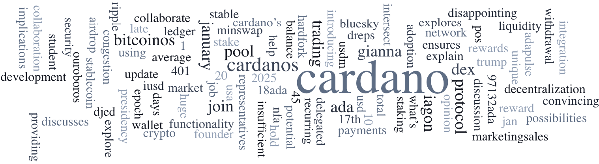

All node users and operators are urged to upgrade to version 10.1.4 to prepare for the Plomin hard fork, with 85% of blocks already using this version. The Interim Constitutional Committee is reviewing the governance action, requiring a two-thirds majority by January 25. Additionally, Delegated Representatives (DReps) have been introduced on the community forum, alongside discussions regarding the network's minimum pool cost.

 [**Read more**](https://forum.cardano.org/t/digest-january-20-2025-all-cardano-node-users-encouraged-to-upgrade-to-node-version-10-1-4-current-status-of-the-icc-voting-introducing-cardano-dreps-on-the-cardano-forum-understanding-cardano-s-min-pool-cost/142215) 

 

