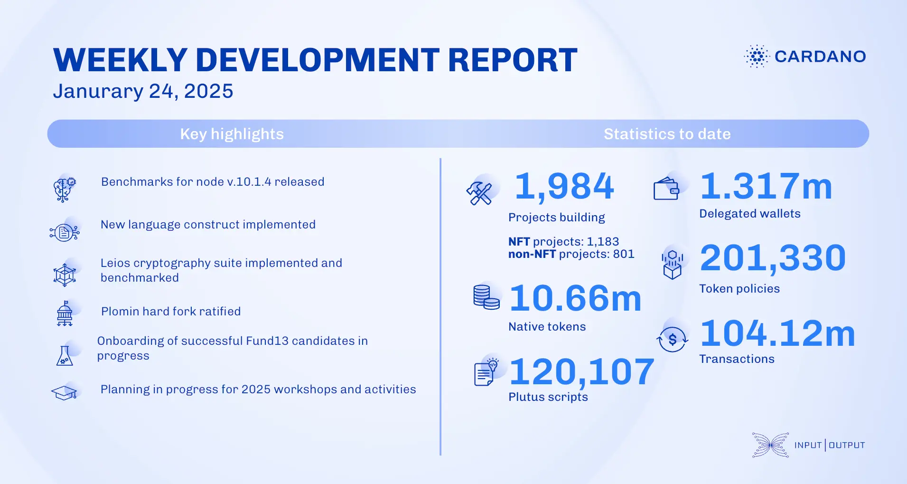

The January 24, 2025, development report highlights consensus team progress on security, documentation, and Peras workstream improvements. The UTXO-HD branch achieved successful local chain synchronization. The performance team benchmarked node v.10.1.4 and introduced a tracing Discord channel. Plutus added the `Fix` construct and CLI tool guides. Hydra completed custom ledger experiments and restored `hydra-explorer`. Mithril advanced incremental database certification. The Leios team benchmarked efficient VRF cryptography.

 [**Read more**](https://www.essentialcardano.io/development-update/weekly-development-report-as-of-2025-01-24) 

 

