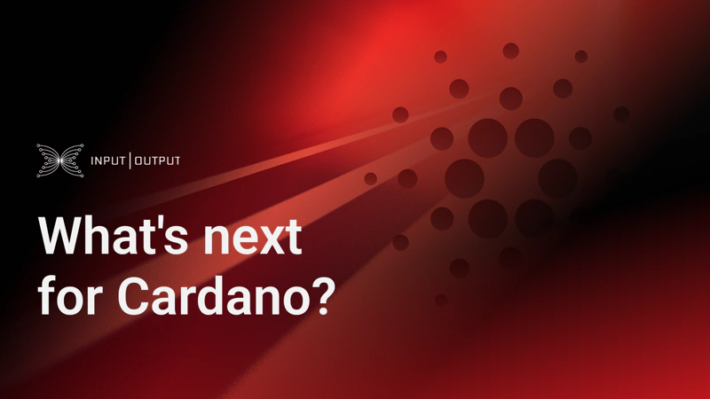

Cardano is transitioning into a community-governed blockchain, emphasizing scalability, usability, and interoperability. The roadmap focuses on advanced scaling solutions like Hydra state channels, layer 2 rollups, and the Ouroboros Leios and Peras protocols to support billions of users by 2030. Enhancements in usability aim to improve the developer experience and broaden decentralized application capabilities. Interoperability efforts include integrating partner chains and sidechains to foster a diverse ecosystem. Community involvement is crucial in shaping this future.

 [**Read more**](https://iohk.io/en/blog/posts/2025/01/29/what-s-next-for-cardano/) 

 

