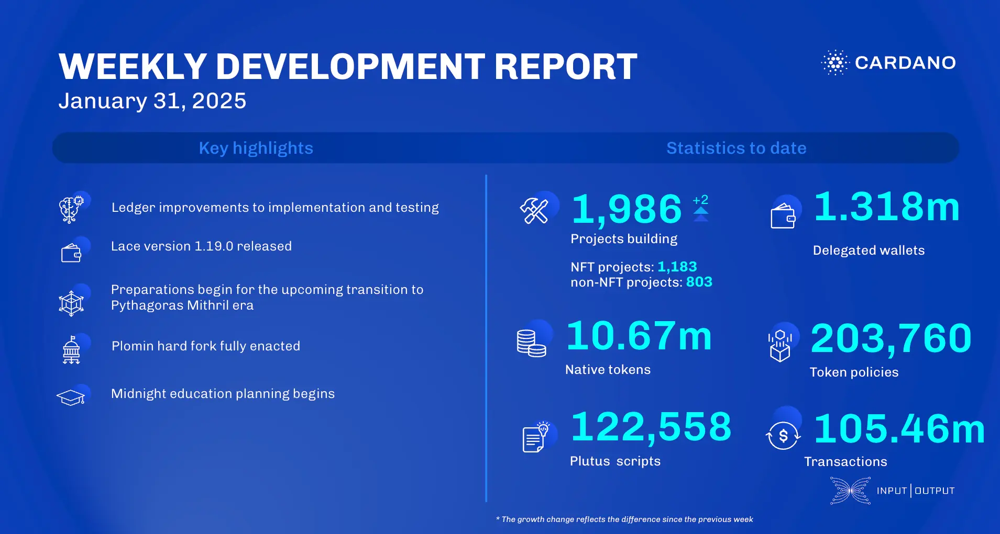

The January 31, 2025, development report highlights the successful implementation of the Plomin hard fork, marking the completion of the Conway ledger era. The ledger team made minor improvements, including removing dependencies and optimizing data structures. The Lace team released version 1.19.0, introducing a DApp explorer and performance enhancements. The Mithril team progressed on incremental certification of the Cardano database and prepared for the upcoming 'Pythagoras' era transition. The Leios team advanced both Haskell and Rust implementations to enhance performance and simulation fidelity.

 [**Read more**](https://www.essentialcardano.io/development-update/weekly-development-report-as-of-2025-01-31) 

 

