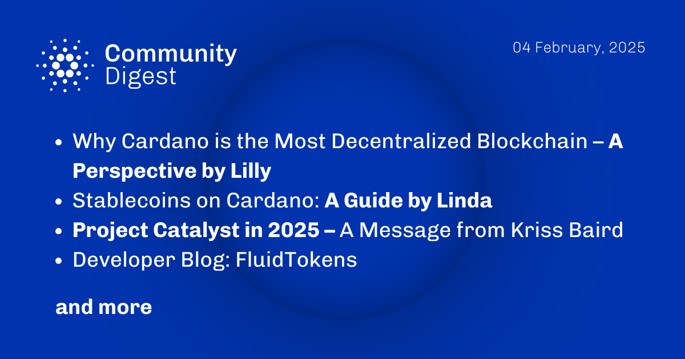

The February 4, 2025, Cardano Community Digest features insights into Cardano's decentralization post-Plomin hard fork, a comprehensive guide to stablecoins on Cardano, and updates on Project Catalyst's 2025 roadmap.dditionally, it includes a developer blog interview with FluidTokens' CTO on unlocking liquidity and Bitcoin DeFi on Cardano.he digest also highlights EMURGO's latest developments and the Cardano Ecosystem Guide 2025.ommunity members are encouraged to stay informed and participate in ongoing governance actions.  

 [**Read more**](https://forum.cardano.org/t/digest-february-3-2025-why-cardano-is-the-most-decentralized-blockchain-a-perspective-by-lilly-stablecoins-on-cardano-a-guide-by-linda-project-catalyst-in-2025-a-message-from-kriss-baird-developer-blog-fluidtokens/142788) 

 

