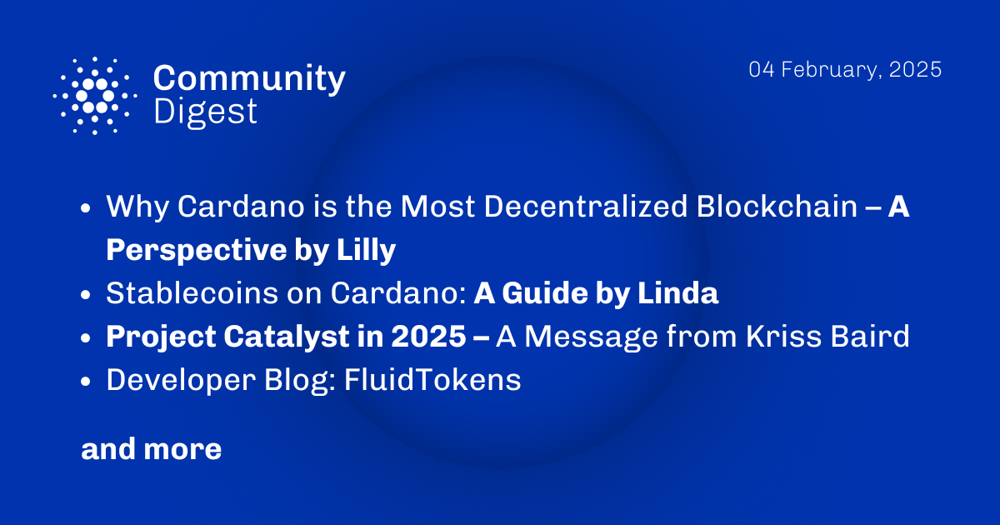

Insights into decentralization post-Plomin hard fork and a comprehensive guide to stablecoins are featured. Project Catalyst has released its 2025 roadmap, while an interview with the FluidTokens CTO explores Bitcoin DeFi and liquidity. Updates also include EMURGO's latest developments and the 2025 Ecosystem Guide, encouraging engagement in ongoing governance actions.

 [**Read more**](https://forum.cardano.org/t/digest-february-3-2025-why-cardano-is-the-most-decentralized-blockchain-a-perspective-by-lilly-stablecoins-on-cardano-a-guide-by-linda-project-catalyst-in-2025-a-message-from-kriss-baird-developer-blog-fluidtokens/142788) 

 

